# Conversation Chart

> **LLM-native diagram skill** — generate publication-ready flowcharts, system diagrams, and data-flow graphs with multi-round controllable edits, occlusion-aware rendering, and PNG / SVG / TikZ export.

[](https://github.com/Daerwang2020/conversation-chart/actions/workflows/ci.yml)
[](LICENSE)
[](https://www.python.org/)


---

## ✨ What is Conversation Chart?

Conversation Chart is a **paper-figure–oriented diagram skill** designed to be driven by LLMs (Claude, GPT-4, etc.) or used directly from the command line. It produces clean, publication-ready diagrams from a declarative JSON source and enforces quality automatically via an occlusion gate.

Key capabilities at a glance:

| Capability | Details |
|---|---|
| 🎨 **Multiple diagram types** | Flowcharts, data-flow diagrams, system architecture, interaction graphs |
| 🔄 **Multi-round controllable edits** | Stable node/edge IDs across rounds; only deltas change |
| 🚫 **Occlusion-aware rendering** | Orthogonal routing + automatic crossing detection |
| 🖼️ **Three export backends** | PNG (paper draft), SVG (Figma/web), TikZ/PDF (LaTeX) |
| 🎨 **LLM color planning** | Category-based palette generated by skill/LLM into `color-plan.json` |
| 📁 **Local file pipeline** | Fully deterministic, scriptable, and CI-friendly |

---

## 📋 Table of Contents

- [Quick Start](#-quick-start)
- [Showcase](#-showcase)
- [How It Works](#-how-it-works)
- [Multi-Round Controllable Edits](#-multi-round-controllable-edits)
- [Occlusion-Aware Quality Gate](#-occlusion-aware-quality-gate)
- [Color Control](#-color-control)
- [Export Backends](#-export-backends)
- [File Interface Reference](#-file-interface-reference)
- [References](#-references)

---

## 🚀 Quick Start

**Prerequisites:** Python 3.11+, [Pillow](https://pillow.readthedocs.io/)

```bash
pip install pillow
```

Run the full local pipeline from a `spec.json`:

```bash
python scripts/run_local_pipeline.py --spec examples/local_interface/spec.json
```

Generated outputs (example: `outputs/local-interface-demo/`):

| File | Description |
|---|---|
| `output.png` | Raster render for paper drafts |
| `output.svg` | Vector render for Figma / Illustrator / web |
| `output.tex` | TikZ source for LaTeX inclusion |
| `output.layout.json` | Computed geometry (stable across rounds) |
| `output.occlusion.json` | Occlusion analysis report |
| `output.map.json` | Source-to-visual ID mapping |
| `output.manifest.json` | Pipeline run status and metadata |
| `output.pdf` *(optional)* | Compiled PDF via `tectonic` / `pdflatex` |

---

## 🖼️ Showcase

### Transformer Architecture

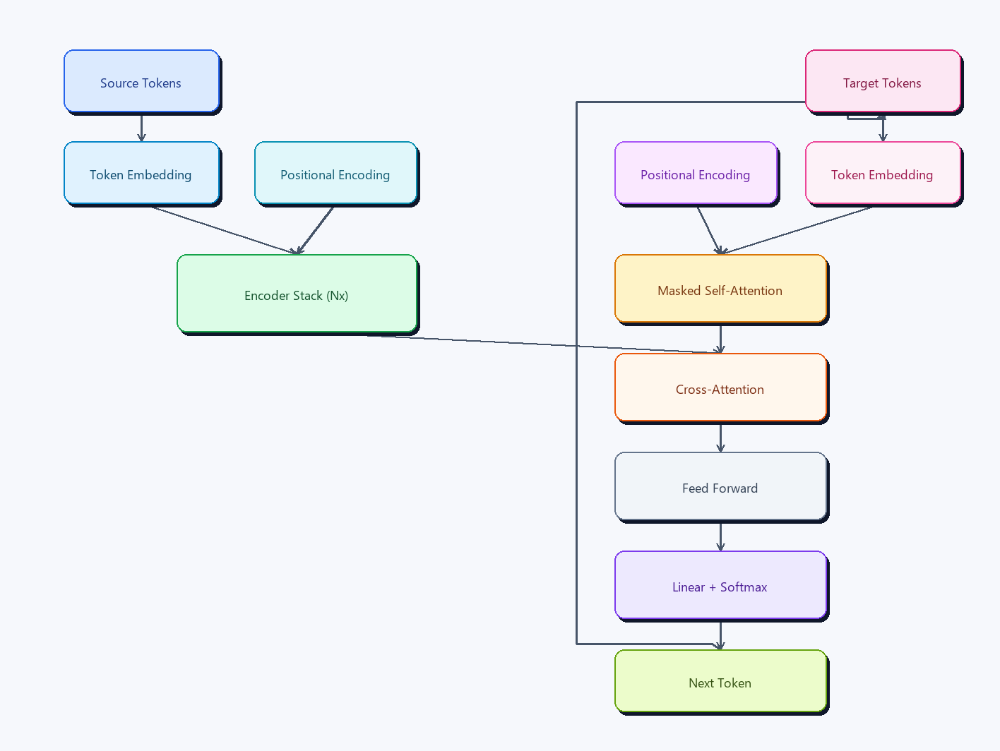

### Classic Network Service Architecture

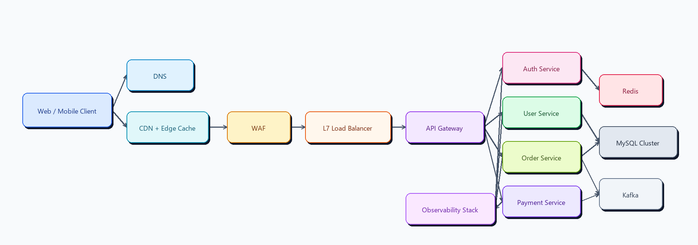

### Data Fabric Architecture

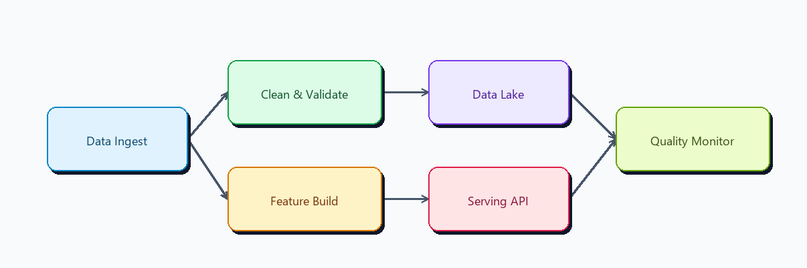

### Product Architecture

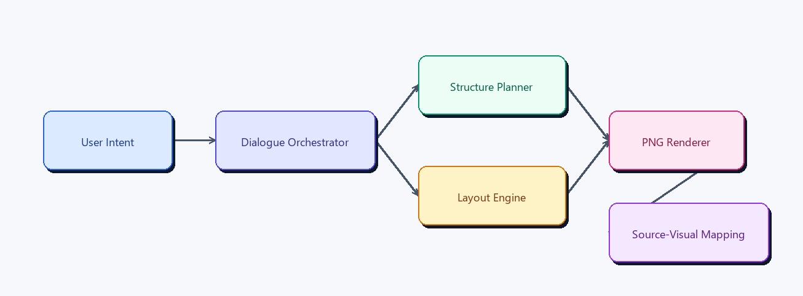

### Realtime Interaction Relationship Graph

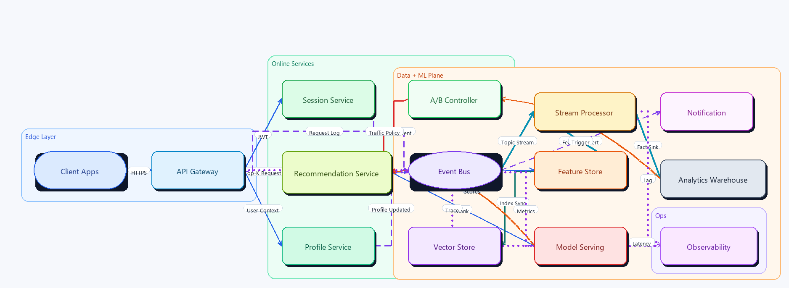

### RAG End-to-End — Multi-Round Controlled Edit

Round 1 (classic RAG baseline):

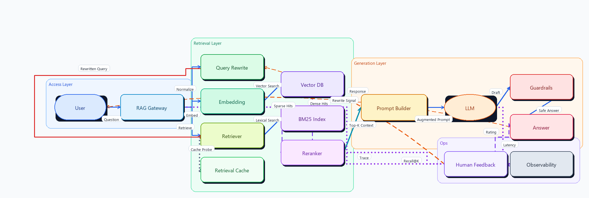

Round 2 (theme switch + architecture upgrade + occlusion-aware routing):

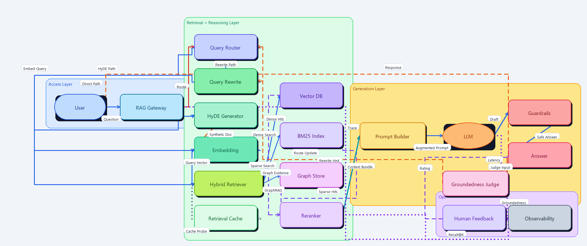

> See [`showcase/rag-end2end/CONTROLLABLE_EDIT_EXAMPLE.md`](showcase/rag-end2end/CONTROLLABLE_EDIT_EXAMPLE.md) for the full edit walkthrough.

### Incident Response — Three-Round Edit

Round 1 → Round 2 → Round 3:

| Round 1 | Round 2 | Round 3 |
|---|---|---|
| 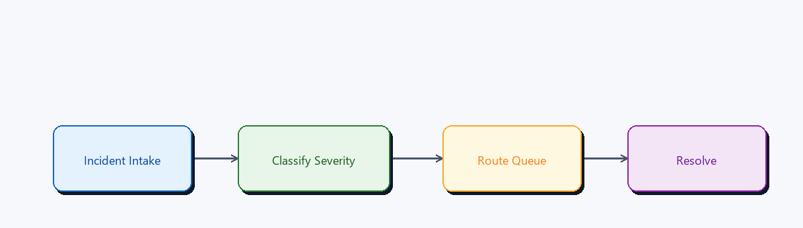 | 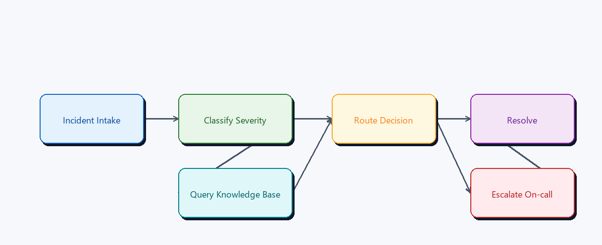 | 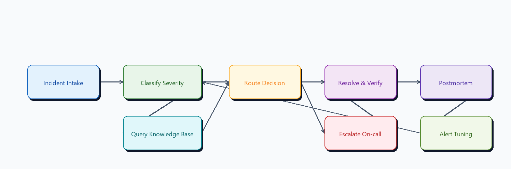 |

### Palette-Only Controlled Edit (LLM Color Plan)

Same structure, different palette:

| Round 1 (category colors v1) | Round 2 (new palette) |
|---|---|
| 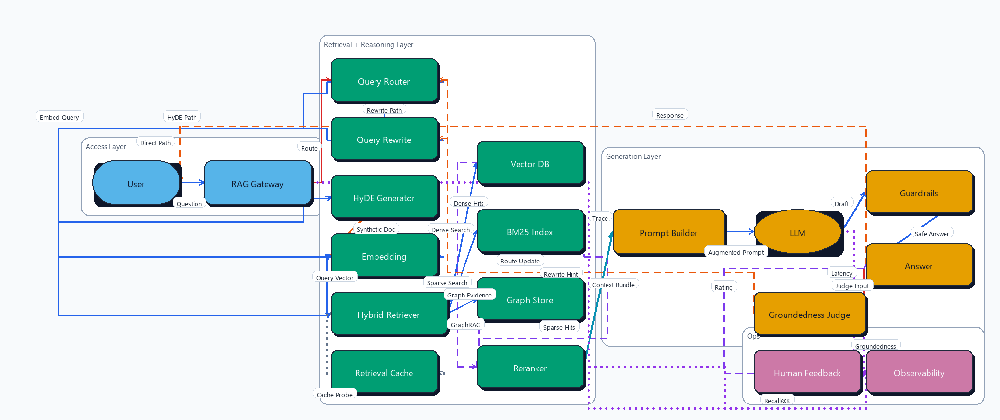 | 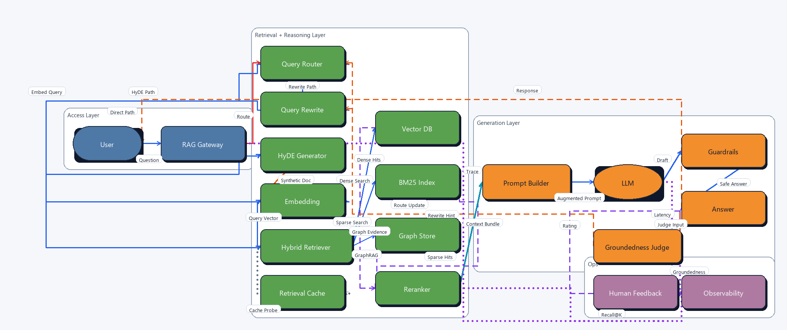 |

> See [`showcase/palette-control/PALETTE_EDIT_EXAMPLE.md`](showcase/palette-control/PALETTE_EDIT_EXAMPLE.md) for the palette-swap walkthrough.

---

## ⚙️ How It Works

```
input.md + spec.json
        │
        ▼
  chart.dsl.json  ──(optional)──  color-plan.json
        │                                │
        │◄───── apply_color_plan.py ─────┘
        │
        ▼
  render_png.py  →  output.png + output.layout.json
        │
        ├── analyze_occlusion.py  →  output.occlusion.json
        ├── render_svg.py         →  output.svg
        └── render_tikz.py        →  output.tex
                                        │
                                  render_tikz_chain.py
                                        │
                                   output.pdf (optional)
```

The **`run_local_pipeline.py`** orchestrator runs all steps in order and writes a `manifest.json` with `status = ok | warning | failed`.

---

## 🔄 Multi-Round Controllable Edits

Conversation Chart enforces **stable IDs** across edit rounds:

- Existing node/edge IDs are never renamed.
- New elements appear as additive IDs.
- Each round writes a `changes.json` diff for traceability.

This makes LLM-driven iterative refinement safe and predictable — the source graph evolves, but nothing breaks silently.

---

## 🚫 Occlusion-Aware Quality Gate

`render_png.py` + `analyze_occlusion.py` jointly enforce rendering quality:

- **Orthogonal obstacle-avoid routing** — edges route around nodes automatically.
- **Edge-vs-node-text crossing checks** — labels never overlap node content.
- **Edge label overlap checks** — label positions are conflict-minimized.
- **Configurable quality gate** — set `max_occlusion_issues` in `spec.json`.

Pipeline status in `manifest.json`:

| Status | Meaning |
|---|---|
| `ok` | All occlusion checks passed |
| `warning` | Occlusion gate exceeded (still rendered) |
| `failed` | Render or export step failed |

---

## 🎨 Color Control

Color strategy is planned by the skill/LLM and written into `color-plan.json`. The renderer executes the plan deterministically — it does not invent colors.

Enable a color plan in `spec.json`:

```json
{
  "dsl": "chart.dsl.json",
  "color_plan": "color-plan.json"
}
```

Example `color-plan.json`:

```json
{
  "color_mode": "category",
  "category_source": "group",
  "category_assignments": {
    "n_user": "access",
    "n_gateway": "access",
    "n_retriever": "retrieval"
  },
  "category_colors": {
    "access": "#56B4E9",
    "retrieval": "#009E73",
    "generation": "#E69F00",
    "ops": "#CC79A7"
  },
  "theme_overrides": {
    "background": "#F8FAFC",
    "edge_color": "#475569"
  }
}
```

The pipeline merges the plan via `scripts/apply_color_plan.py` and renders from `{basename}.colored.dsl.json`. A sample plan is at [`examples/local_interface/color-plan.sample.json`](examples/local_interface/color-plan.sample.json).

---

## 📦 Export Backends

| Backend | Script | Use case |
|---|---|---|
| **PNG** | `render_png.py` | Paper drafts, previews, README embeds |
| **SVG** | `render_svg.py` | Figma, Illustrator, web publishing |
| **TikZ** | `render_tikz.py` + `render_tikz_chain.py` | LaTeX papers, high-quality PDF |

TikZ compile chain supports `tectonic` (auto-detected) or `pdflatex`, with optional PDF→PNG conversion via `pdftoppm` / `magick`.

---

## 📁 File Interface Reference

### Inputs

| File | Required | Description |
|---|---|---|
| `spec.json` | ✅ | Pipeline configuration (DSL path, output dir, formats, options) |
| `chart.dsl.json` | ✅ | Declarative graph source (nodes, edges, groups, theme) |
| `input.md` | optional | Natural-language context for the skill/LLM |
| `color-plan.json` | optional | LLM-generated color strategy |

### Core Scripts

| Script | Description |
|---|---|
| `scripts/run_local_pipeline.py` | Full pipeline orchestrator |
| `scripts/render_png.py` | PNG + layout renderer |
| `scripts/analyze_occlusion.py` | Occlusion analysis and quality gate |
| `scripts/render_svg.py` | SVG export |
| `scripts/render_tikz.py` | TikZ source export |
| `scripts/render_tikz_chain.py` | TikZ → PDF compile chain |
| `scripts/apply_color_plan.py` | Merge color plan into DSL |
| `scripts/export_mapping.py` | Source-to-visual ID mapping export |

---

## 📚 References

- [`SKILL.md`](SKILL.md) — Skill definition (name, description, execution workflow, quality rules)
- [`references/output-contract.md`](references/output-contract.md) — Output file contract
- [`references/edit-protocol.md`](references/edit-protocol.md) — Multi-round edit protocol
- [`references/color-presets.md`](references/color-presets.md) — Curated color palette presets
- [`showcase/rag-end2end/CONTROLLABLE_EDIT_EXAMPLE.md`](showcase/rag-end2end/CONTROLLABLE_EDIT_EXAMPLE.md) — Multi-round edit walkthrough
- [`showcase/palette-control/PALETTE_EDIT_EXAMPLE.md`](showcase/palette-control/PALETTE_EDIT_EXAMPLE.md) — Palette-swap walkthrough

---

## License

[MIT](LICENSE)

